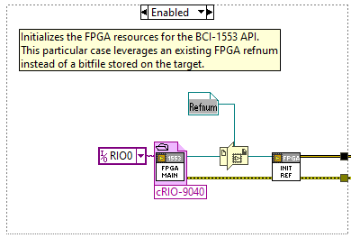

# BCI-1553 LabVIEW API

This package provides an API for controlling the BCI-1553 module from a RealTime controller. The API exposes nearly all the capabilities of the module, as opposed to the simplified operations built for use in FPGA. All 1553 terminal functionality is available, allowing the concurrent configuration and control of a Bus Controller, Bus Monitor, and two Remote Terminals on a single module. The API also performs native parameterization of bitfields, converting between double data values and bitfields.

> [!NOTE]
> This API requires the BCI-1553 modules(s) to be in the Advanced operating mode.

## Installation

The BCI-1553 LabVIEW API is distributed as a VI Package which can be downloaded from this repository's [releases page](https://github.com/BloomyControls/bci-1553-labview-api/releases). After downloading the VI package, double click to install using VI Package Manager.

The package can also be rebuilt from source using the VI package build specification at `./build/BCI-1553 RealTime Driver.vipb`.

## Examples

The BCI-1553 LabVIEW API package will install an example project under `<LabVIEW Examples>\Bloomy\BCI-1553 API\RealTime\BCI-1553 RealTime Example.lvproj`. This project demonstrates basic Bus Controller, Remote Terminal, and Bus Monitor functionality.

### FPGA

The BCI-1553 LabVIEW API implements a simple "BCI-1553 RealTime Interface.vi" which can be used to to provide an interface for up to 8 BCI-1553 modules.

+ **DMA FIFO References**: DMA FIFOs are used to transfer command and response data between the Real-Time application and FPGA interface. The data type of both DMA FIFOs must be U64. Additionally, the Host to Target DMA FIFO must be named "BCI-1553-CMD" and the Target to Host DMA FIFO must be named "BCI-1553-RSP" for the Real-Time API to function.
+ **BCI-1553 References**: These references denote the BCI-1553 modules in slots 1-8 of the cRIO chassis.
+ **Stop Occurrence**: An occurrence is used to stop execution of the BCI-1553 engine. Use the set occurrence primitive to stop execution of the BCI-1553 RealTime Interface.

> [!IMPORTANT]
> To build the FPGA bitfile, you must install the [BCI-1553 FPGA Driver](https://www.bloomy.com/products/slsc-and-crio-modules-and-accessories/1553b-c-series-module#tabs=5).

### Real-Time

The BCI-1553 RealTime Example project contains a single RT example `All Modes - Single Module.vi` which configures a single BCI-1553 in slot 1 to act as a Bus Controller, Bus Monitor, and 2 Remote Terminals.

Documentation on the VI's front panel explains the various commands which can individually be executed by setting the **Example Control** enumeration.

If you are not using a cRIO 9030, you will need to recompile the example FPGA code for your specific target and update the FPGA initialization code in the RT example. There are several disabled cases on the block diagram showing different methods for initilization the FPGA bitfile.

## Development

The BCI-1553 LabVIEW API is developed using the following software:

+ [LabVIEW 2020 SP1](https://www.ni.com/en/support/downloads/software-products/download.labview.html#369659)
  + [LabVIEW Real-Time Module](https://www.ni.com/en/support/downloads/software-products/download.labview-real-time-module.html#558654)
  + [LabVIEW FPGA Module](https://www.ni.com/en/support/downloads/software-products/download.labview-fpga-module.html#558660)
+ [CompactRIO Driver](https://www.ni.com/en/support/downloads/drivers/download.ni-compactrio.html#564323)
+ [Caraya Unit Test Framework](https://www.vipm.io/package/jki_lib_caraya/)

## Details

[API Configuration Options](./docs/Configuration_Options.md)

[Holt HI-6131 Documentation](./docs/hi-6130_v-rev-z7.pdf)

## License

Copyright (c) 2025, Bloomy Controls, Inc. All rights reserved.

This software is distributed under the BSD-3-clause license. See the LICENSE
file or <https://opensource.org/license/BSD-3-Clause> for details.